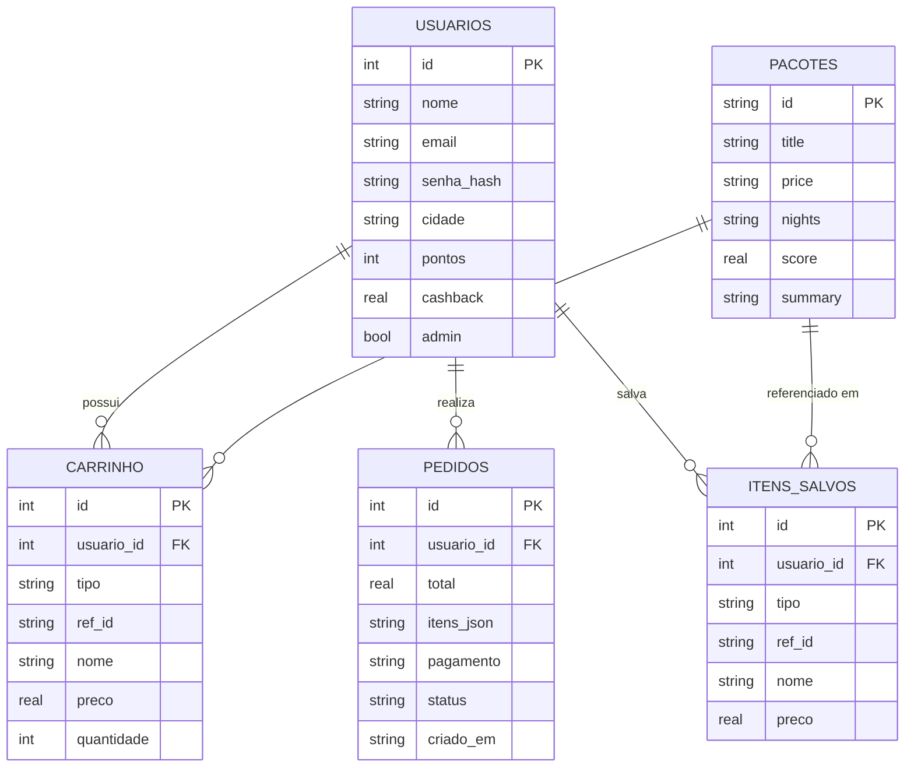

# Diagrama do Banco de Dados (Modelo Entidade-Relacionamento)

Este é o modelo de dados do Eco Companion. O usuário é a entidade central.

## Relações

- Um **usuário** possui muitos itens no **carrinho** (1:N)
- Um **usuário** realiza muitos **pedidos** (1:N)
- Um **usuário** salva muitos **itens salvos** (1:N)
- Um **pacote** pode estar em muitos itens de **carrinho** (1:N)
- Um **pacote** pode ser referenciado em muitos **itens salvos** (1:N)

## Código Mermaid (cole em https://mermaid.live para visualizar)

## Decisão de design importante

Nos **pedidos**, os itens comprados são guardados como `itens_json` — uma "fotografia" do que foi comprado no momento. Assim, o histórico do pedido preserva os dados originais mesmo que o pacote mude de preço ou seja excluído depois.
